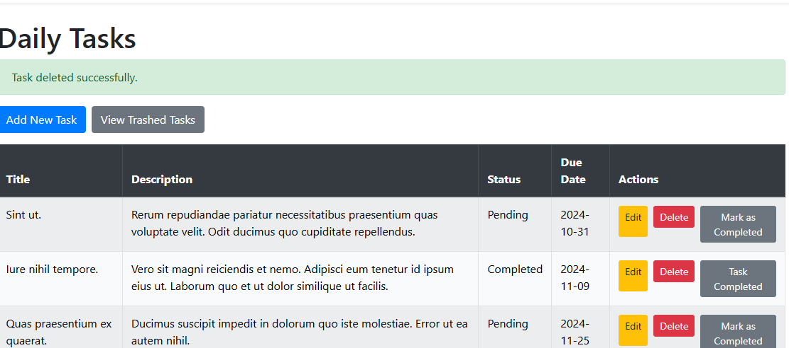

# Daily Task Manager

This is a simple daily task management system built using Laravel, Blade, and Cron Jobs. The system allows users to add, edit, delete tasks, and automatically sends a daily email with pending tasks.

## Features:
- User authentication (login, register)
- Create, edit, delete tasks
- Mark tasks as completed or pending
- Soft delete functionality for tasks with the ability to restore or permanently delete them
- View trashed tasks in a dedicated interface
- Automatic email notification for pending tasks using Cron Jobs

## Requirements:
- PHP >= 7.3
- MySQL
- Composer
- Mailtrap (for testing emails)

## Installation Steps:

1. Clone the repository:

   git clone https://github.com/SafaaNahhas/DailyTaskManager.git
  

## Scheduled Task: Sending Daily Pending Task Emails

Automated Daily Email for Pending Tasks
This feature allows the application to send an automatic daily email to each user with a list of their pending tasks. The following steps outline the components needed and the process to set up and test the email functionality.

1. Email Setup
Configure the email server in the .env file. This setup provides the foundation for sending emails from the application, using services like Mailtrap or another email provider.

in file .env:

MAIL_MAILER=smtp

MAIL_HOST=smtp.mailtrap.io

MAIL_PORT=2525

MAIL_USERNAME=your_mailtrap_username

MAIL_PASSWORD=your_mailtrap_password

MAIL_ENCRYPTION=tls

MAIL_FROM_ADDRESS=example@example.com

MAIL_FROM_NAME="Task Manager"

2. Mailable Creation
A Mailable class is used to define the structure of the email. This includes the message’s subject, body content, and any data passed to the email, such as the user’s details and their pending tasks. The Mailable ensures that the email layout and content are consistent.

php artisan make:mail PendingTasksMail

then create a blade for email:

emails.pendingtasks.blade.php 

3. Command Creation
A custom command is set up to automate the email-sending process. This command retrieves each user’s pending tasks and sends an email listing them. By using Laravel's Command structure, we create a clear and reusable command that can be scheduled as needed.

php artisan make:command SendPendingTasksEmail

4. Scheduling with Cron Job
The command is added to Laravel’s scheduler to run daily, so users receive updates on pending tasks every day. Laravel’s scheduler streamlines the Cron Job setup, ensuring regular email delivery without manual intervention.

 app/Console/Kernel.php:

protected function schedule(Schedule $schedule)
{
    $schedule->command('app:send-pending-tasks-email')->daily();
}

5. Testing the Command
To confirm functionality, the command can be run manually. Successful testing ensures that emails are delivered as expected and that all automated components are in place.

php artisan app:send-pending-tasks-email
or
php artisan schedule:run 

If you want to work always and not just once, use the following command:
php artisan schedule:work

#### Task Index Page

#### Create Task Page

#### Edit Task Page

#### Delete Task 

#### MailTrap Email

